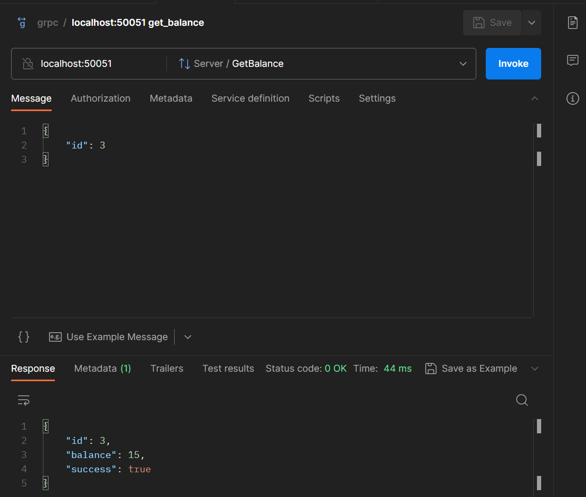

# Microservice for working with user balance

# Stack
+ gRPC
+ PostgreSQL
+ golang-migrate/migrate
+ sqlx
+ logrus
+ Docker
+ golangci-lint

# Getting Started
1. `git clone https://github.com/evgkhm/grpcAvito`
2. `cd grpcAvito`
3. `make run`

# Implemented
1. Метод начисления средств на баланс
2. Метод резервирования средств
3. Метод признания выручки
4. Метод получения баланса пользователя
5. Доп. задания:
 - Доп. задание 1 (метод для получения месячного отчета) в csv файл
 - Сценарий разрезервирования денег

# API
| Endpoint                                   | gRPC method |                          Description |
|--------------------------------------------|:-----------:|-------------------------------------:|
| /user/get_balance/{id}                     |     GET     | Метод получения баланса пользователя |
| /user/create_user                          |    POST     |          Метод создания пользователя |
| /user/accrual_balance                      |    POST     |   Метод начисления средств на баланс |
| /order/reservation                         |    POST     |         Метод резервирования средств |
| /order/revenue                             |    POST     |              Метод признания выручки |
| /order/delete_reservation                  |    POST     |               Метод удаления резерва |
| /report/create_month_report/{year}/{month} |     GET     |          Получение месячного отсчета |

# Example
Получение текущего баланса

# For database connecting
1. Из командной строки выполнить docker ps
2. Найти CONTAINER ID
3. Выполнить docker exec -it CONTAINER ID /bin/bash
4. Подключение к БД psql -U admin -d users

# For proto-files generating
`make proto`

# For start local without docker
Add path to config.yaml. E.g.:

`CONFIG_PATH=C:\Users\User\grpcAvito\internal\config\config.yaml`

# For start linter
`make lint`

Linter will create lint.txt file