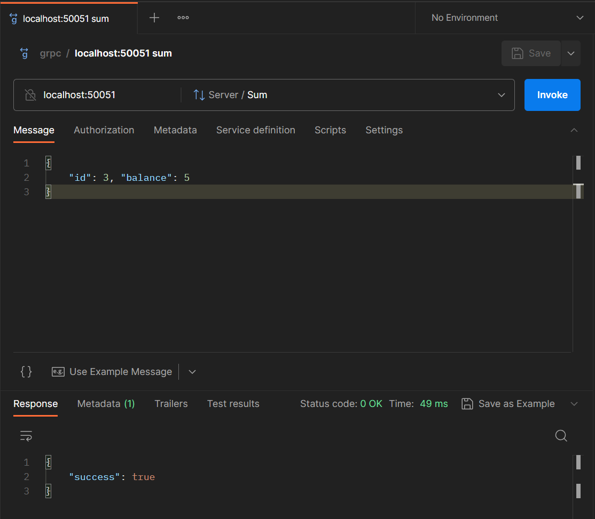
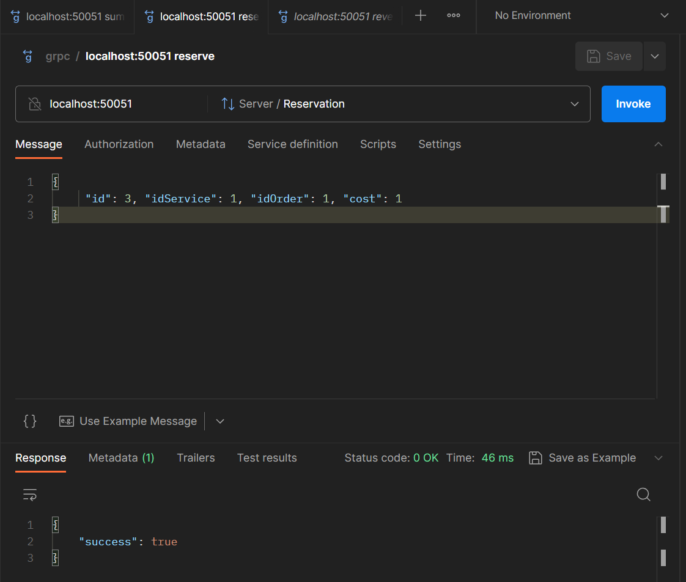
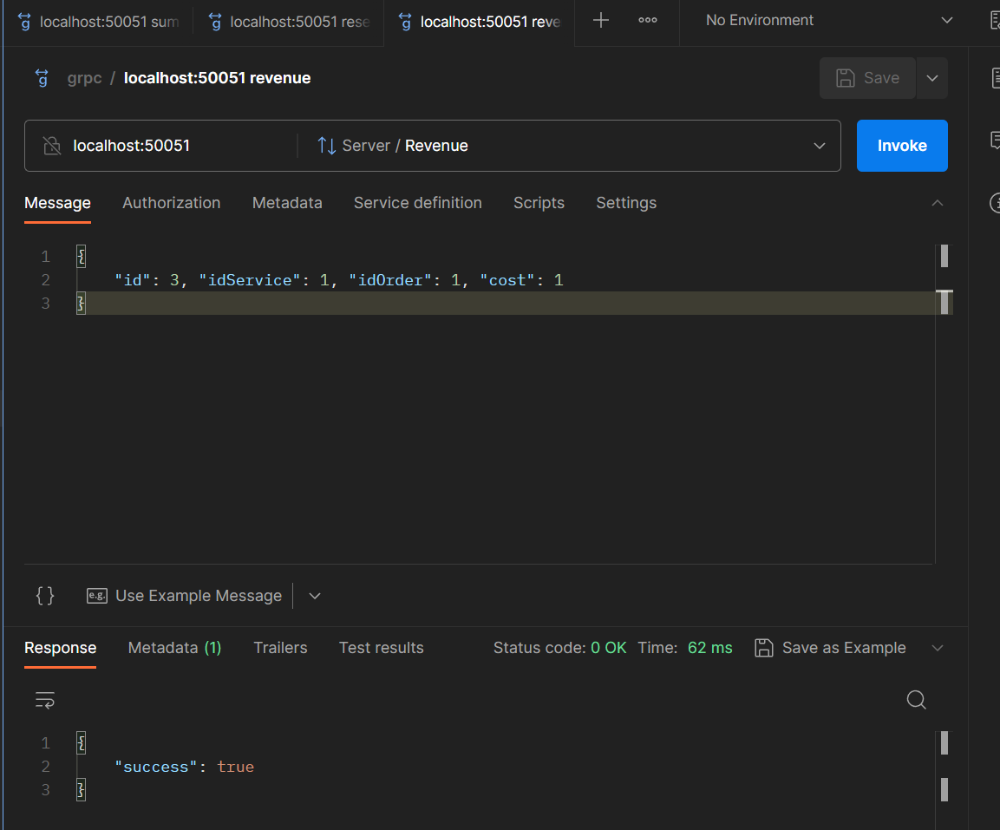
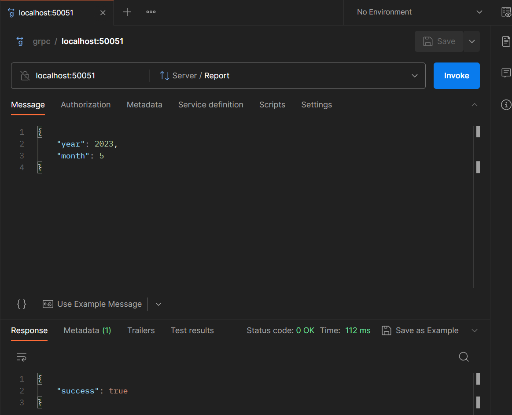
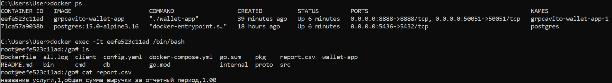
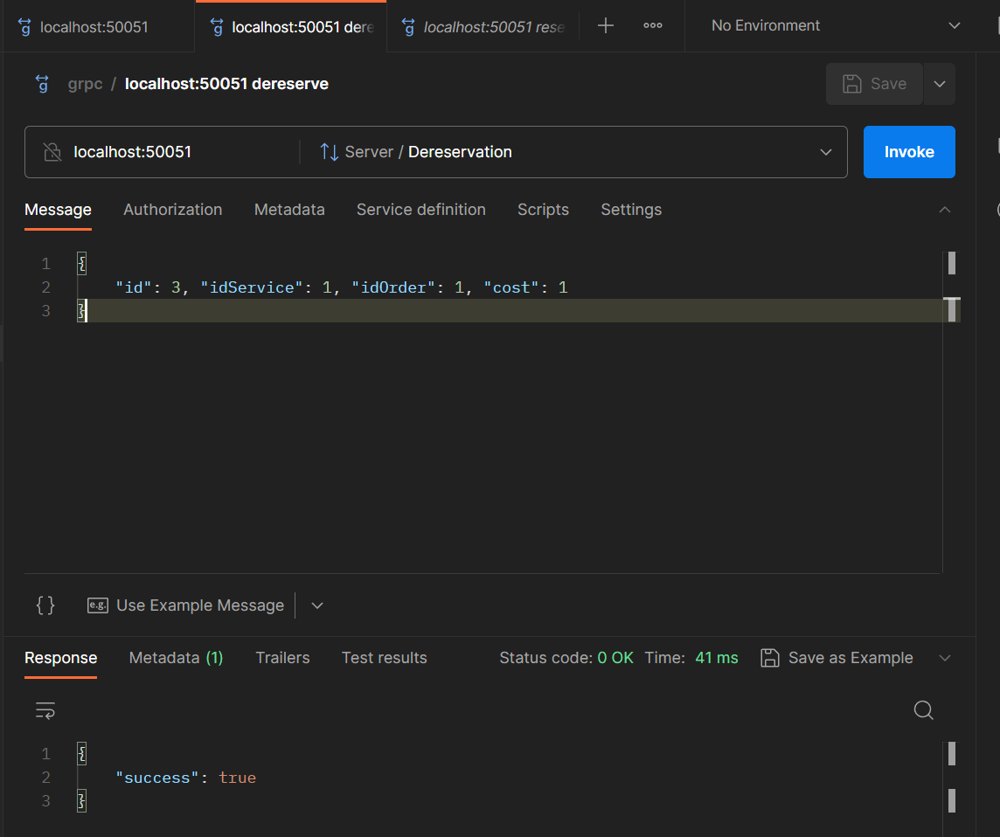
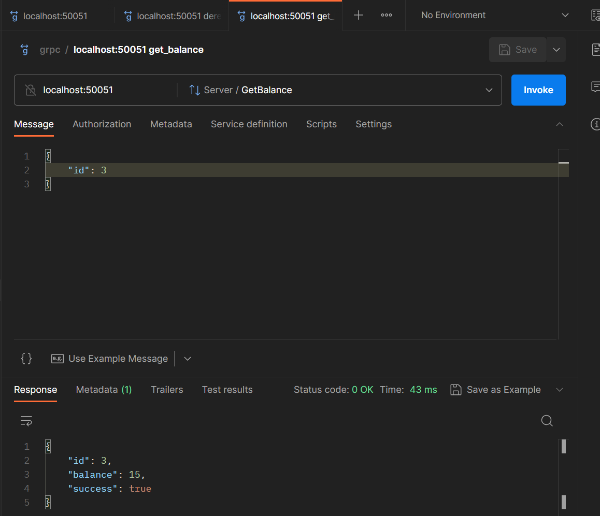

# Microservice for working with user balance

# Stack
+ gRPC
+ PostgreSQL
+ golang-migrate/migrate
+ sqlx
+ logrus
+ Docker

# Getting Started
1. `git clone https://github.com/evgkhm/grpcAvito`
2. `cd grpcAvito`
3. `docker-compose up --build`

# Implemented
1. Метод начисления средств на баланс
2. Метод резервирования средств
3. Метод признания выручки
4. Метод получения баланса пользователя
5. Доп. задания:
 - Доп. задание 1 (метод для получения месячного отчета) в csv файл
 - Сценарий разрезервирования денег

# Examples
Создание пользователя

Начисление средств

Резервирование средств

Признание выручки

Получение месячного отсчета

Создается report.csv с данными

Разрезервирование денег

Получение текущего баланса

# For database connecting
1. Из командной строки выполнить docker ps
2. Найти CONTAINER ID
3. Выполнить docker exec -it CONTAINER ID /bin/bash
4. Подключение к БД psql -U admin -d users

# For proto-files generating
protoc -I ./proto --go_out ./proto --go_opt paths=source_relative --go-grpc_out ./proto --go-grpc_opt paths=source_relative --grpc-gateway_out ./proto --grpc-gateway_opt paths=source_relative ./proto/server.proto